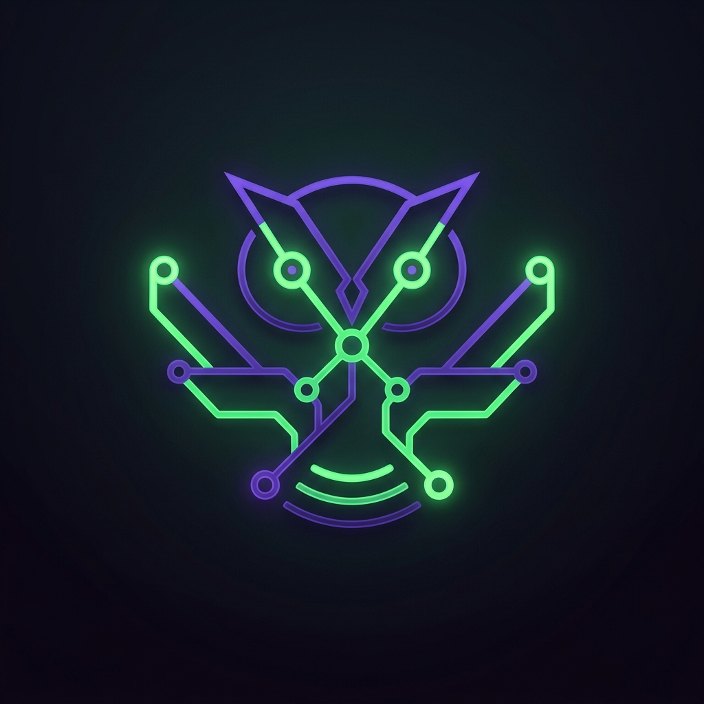
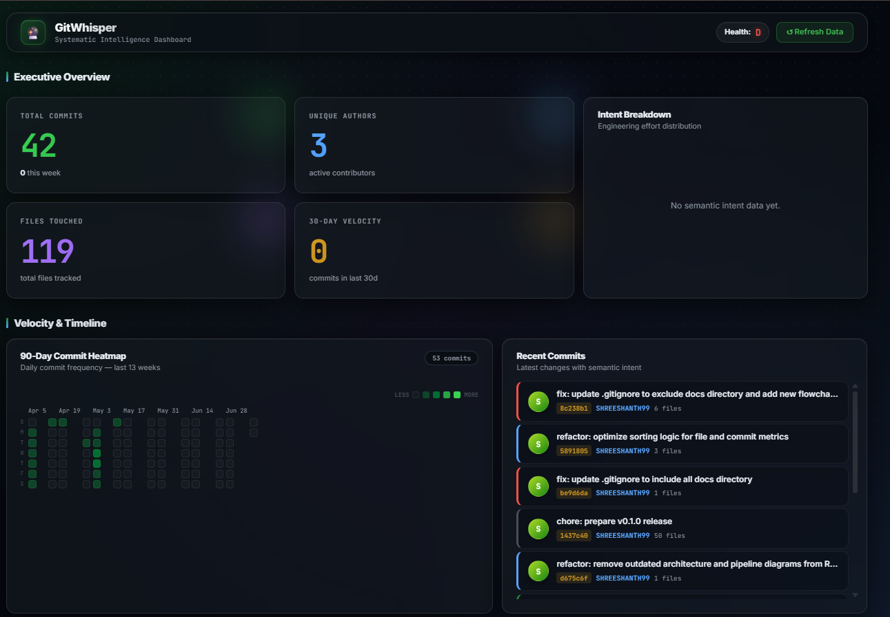

<div align="center">
  
  
  <h1>GitWhisper</h1>
  
  <p>
    <strong>AI-powered Git intelligence for developers and teams.</strong><br>
    GitWhisper captures commit context, analyzes change intent, explains code evolution, and turns raw Git history into practical engineering insight.
  </p>

  <p>
    <a href="https://github.com/SHREESHANTH99/GitWhisper/actions/workflows/ci.yml"></a>
    <a href="https://github.com/SHREESHANTH99/GitWhisper/actions/workflows/release.yml"></a>
    <a href="LICENSE"></a>
    
    
  </p>
  
  <p>
    <a href="#what-gitwhisper-does"><b>Overview</b></a> •
    <a href="#-systematic-intelligence-dashboard"><b>Dashboard</b></a> •
    <a href="#-quick-start"><b>Quick Start</b></a> •
    <a href="#%EF%B8%8F-complete-cli-reference"><b>Commands</b></a> •
    <a href="#%E2%9A%99%EF%B8%8F-configuration"><b>Configuration</b></a>
  </p>
</div>

---

## 🌟 What GitWhisper Does

Git already tells you **what** changed. GitWhisper helps explain **why** it changed, how risky it is, who knows the area best, and what reviewers should inspect next.

Built entirely in **Rust** for maximum speed and safety, GitWhisper runs seamlessly inside your Git repository. It combines Git history, commit-time context, semantic diff analysis, and AI explanation to deliver unparalleled collaboration outputs.

---

## 📊 Systematic Intelligence Dashboard

Experience premium, state-of-the-art telemetry detailing your project's engineering health, intent breakdown, repository risk, and file churn — all securely computed on your local machine.

<div align="center">
  
  <p><i>Live project intelligence powered by the GitWhisper local analytics engine.</i></p>
</div>

Run the dashboard instantly from your terminal:
```bash
gitwhisper dashboard --port 7878
```

---

## ⚡ Quick Start

### 1. Build and Install

```bash
git clone https://github.com/SHREESHANTH99/GitWhisper.git
cd GitWhisper
cargo install --path .
```

### 2. Bootstrap Your Repository

Initialize the managed `post-commit` hook to automatically capture and annotate new commits:

```bash
gitwhisper init
gitwhisper capture
gitwhisper annotate
```

### 3. Actionable Commands

Once initialized, try uncovering project insights immediately:

```bash
gitwhisper explain src/main.rs          # Explain why a file changed
gitwhisper summarize src/main.rs        # Tell the file's evolution story
gitwhisper refactor-priority src        # Rank files most worth refactoring
gitwhisper owners src                   # Find out who really owns the code
```

---

## 🏗️ Architecture & Pipelines

GitWhisper operates through several intelligent pipelines to maximize utility without interrupting your workflow.

### Commit Capture
The capture layer stores metadata and sanitized context. It **does not** capture full IDE file contents.

### AI Explanation
Our hybrid engine defaults to fast **local explanation** via Ollama for smaller prompts, leverages **cloud AI** (Gemini) for deeper analysis when configured, and falls back to deterministic heuristic summaries if AI is unavailable.

### Engineering Health Analysis
GitWhisper proactively computes Code Quality, Security, Performance, Bug-Prediction, Knowledge-Silo risks, and Refactor priorities, offering a powerful heuristic safety net.

### Zero-Setup Storage
Defaults to local `JSON` storage so you can get started instantly, while natively supporting `PostgreSQL` for Docker & Team workflows.

---

## 🛠️ Complete CLI Reference

### Core History & Explanation
| Command | Purpose |
| --- | --- |
| `init` | Install the managed post-commit hook |
| `capture` | Capture context for the current `HEAD` commit |
| `annotate [commit]` | Generate an explanation and store it in Git notes |
| `explain <file>` | Explain why a file changed using context |
| `timeline <file>` | Show a file's detailed commit timeline |
| `owners <path>` | Show likely code owners and knowledge silos |

### Risk & Health
| Command | Purpose |
| --- | --- |
| `quality <path>` | Analyze complexity, duplication, churn, and maintainability |
| `security <path>` | Flag security-sensitive patterns and risky changes |
| `performance <path>`| Flag performance-sensitive patterns and hotspots |
| `bug-predict [path]`| Rank likely bug-prone files based on churn and complexity |
| `refactor-priority` | Rank files most worth refactoring |

### Collaboration & Team Integration
| Command | Purpose |
| --- | --- |
| `dashboard` | Start the local analytics UI (`--host 127.0.0.1 --port 7878`) |
| `share slack/discord`| Send a commit explanation directly to team chats |
| `review github/gitlab`| Publish a PR/MR helper summary |
| `digest slack` | Send an automated daily or weekly project digest |
| `wiki --output wiki` | Generate Markdown wiki pages automatically |
| `adr --output docs` | Generate Architecture Decision Records (ADRs) |

---

## ⚙️ Configuration

GitWhisper seamlessly reads `.gitwhisper.toml` from your repository root and loads `.env` files automatically.

```toml
[ai]
provider = "hybrid" # cloud | local | hybrid
model = "gemini-1.5-flash"
local_model = "mistral"
prompt_char_budget = 12000
hybrid_max_prompt_chars = 8000
ollama_url = "http://localhost:11434"

[privacy]
offline_mode = false
local_cache_only = true
exclude_files = ["secrets.json", "*.pem"]

[database]
backend = "json" # json | postgres
```

---

## 🐳 Docker & PostgreSQL

Ready to deploy GitWhisper for your whole team?

```bash
docker compose up --build
```
| Service | URL |
| --- | --- |
| **GitWhisper Dashboard** | `http://localhost:7878` |
| **Ollama Local AI** | `http://localhost:11434` |
| **PostgreSQL Backend** | `localhost:55432` |

---

## 🔒 Privacy & Security

Your code is your business. Cloud AI and team integrations are **opt-in**. 

- Set `privacy.offline_mode = true` to strictly prevent cloud AI selection.
- Set `privacy.local_cache_only = true` to force explanations to remain locally cached.
- Please review [SECURITY.md](SECURITY.md) before reporting vulnerabilities.

---

## 🤝 Contributing

We welcome community contributions! Read our [CONTRIBUTING.md](CONTRIBUTING.md) for local setup instructions and PR guidance. Easiest areas to jump into:
- 🧪 Analyzer & Integration Tests
- 🌐 Dashboard UI Polish
- 📝 Language Parsers

---

<p align="center">
  <i>Released under the <a href="LICENSE">MIT License</a>. Crafted with ❤️ for better engineering.</i>
</p>
